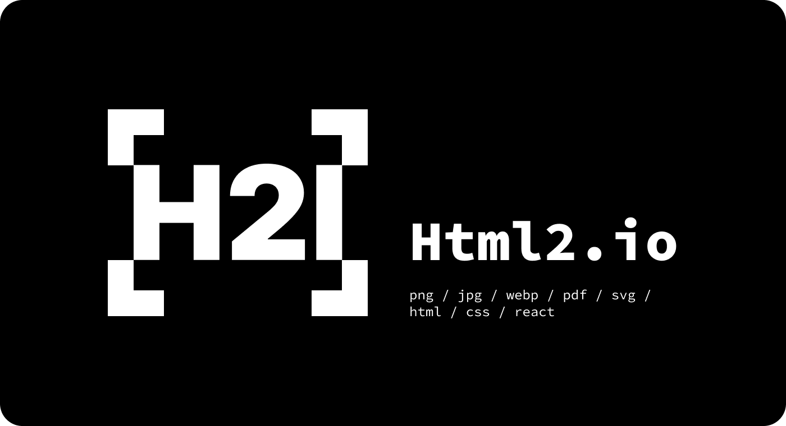

<p style="text-align:center;">
  
  <a href="https://html2.io"><h1 style="text-align:center;">html2.io</h1></a>
  <p style="text-align:center;">Html to image as a service</p>
</p>

## Features

- HTML/CSS to image
- HTML/CSS to pdf
- Markdown to image
- Native fonts & emoji support (Apple emoji OK)
- Template engine
- Write Template with React
- CDN Ready

## Usage

**Install**

- [NPM - `@html2/io`](https://www.npmjs.com/package/@html2/io)
- [PyPi - `html2`](https://pypi.org/project/html2/)

```
yarn add @html2/io
```

**Simple usage**

```ts
import IO from "@html2/io";

const io = new IO();

io.fromFile("test.html").then((image) => {
  image.save("test.png");
});

io.fromUrl("https://google.com").then((image) => {
  image.save("google.png");
});

io.fromHtml("<h1>Hello world</h1>").then((image) => {
  image.save("hello.png");
});

io.fromMd("# Hello world").then((image) => {
  image.save("hello.png");
});

io.fromRepo("https://github.com/gridaco/html2.io", {
  branch: "master",
  path: "README.md",
}).then((image) => {
  image.save("readme.png");
});
```

## Aknowledgements

Special thanks to:

- Puppeteer
- Chromium

## License

The source code and artworks are [Apache 2.0 licensed](./LICENSE), yet it is not allowed to deploy the whole service to make a replica service for money without huge modification.
